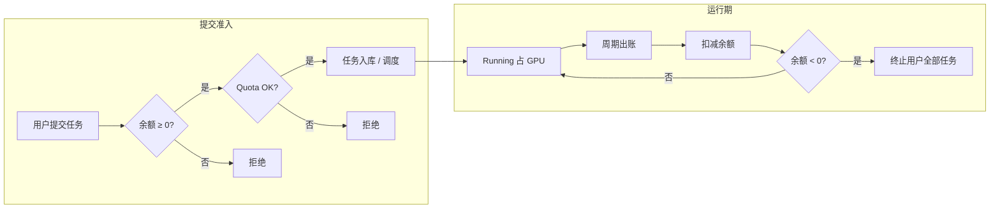

# Portal 任务准入（Admission）

算想云在 **Global Scheduler** 层对用户提交的训练、推理、Jupyter、FineTune 等 workload 做**策略型准入**：能否接单取决于账户是否仍可计费、是否超过可选并发上限。这与 **集群是否有空资源**（全局调度 / CPod 心跳）是两层问题：准入回答「平台是否允许该用户再占资源」，调度回答「资源放在哪」。

计费流水与充值细节见 [BILLING.md](./BILLING.md)（待完善）。全局调度见 [GLOBAL_SCHEDULER_SCORING.md](./GLOBAL_SCHEDULER_SCORING.md)。

---

## 一、设计原则

| 原则 | 说明 |
|------|------|
| **余额优先** | 平台按用量计费；准入以「账户未欠费」为主闸门，避免无支付能力用户持续占用 GPU。 |
| **Quota 可选** | 并发上限按用户、按 GPU 型号配置；未配置则不限并发，便于默认开放与运营按需收紧。 |
| **创建时检查，运行期纠偏** | 提交任务时做余额与 Quota 快照检查；运行中通过周期性出账扣余额，欠费后统一停任务。 |
| **与 K8s 隔离正交** | 命名空间 `ResourceQuota`、网络策略等是**集群内**多租户隔离，不替代 Portal 准入（见 [NAMESPACEISOLATION.md](./NAMESPACEISOLATION.md)）。 |

---

## 二、余额（Balance / 账户额度）

**角色：** 主准入条件 — 「用户是否还有权使用付费算力」。

**模型（概念）：**

- 每个用户一条账户余额（货币单位，可充值、可扣减）。
- 新用户注册时可配置 **初始赠送额度**（配置项 `InitBalance`，产品/UI 上常称为 credits 或体验金），记一笔开通流水。
- 运行中的任务按周期产生 **未结清账单**；后台任务（可开关）聚合扣减余额并将账单标为已结清。

**准入：**

- **提交任务时：** 若当前余额 **小于 0**，拒绝创建（「余额不足」）。注意：创建时**不**估算本次任务总价是否够用，只要求未处于欠费状态。
- **运行中：** 出账后若余额 **小于 0**，对该用户 **终止全部任务**（欠费清场），防止继续消耗。

**设计取舍：**

- 用「非负余额」而非「预估 N 小时费用」做门禁，实现简单、与后付费/按周期出账一致；代价是余额刚耗尽到变负之间可能仍有短窗口在跑，靠 cron 清场收敛。
- 余额与 Quota 独立：有钱但仍可被 Quota 拦住；有 Quota 余量但已欠费仍不可提交。

---

## 三、Quota（GPU 并发配额）

**角色：** 辅助准入 — 「该用户在同一 GPU 型号上最多同时跑多少卡」，用于公平、防滥用或合同上限。

**模型（概念）：**

- 按 **(用户, GPU 类型字符串)** 配置上限（整数卡数）。
- **无配置行 = 不限制** 该用户在该 GPU 类型上的并发（与余额检查无关）。

**占用口径：**

- 只统计 Portal 侧状态为 **Running** 的训练、推理、Jupyter（及 FineTune 关联训练规格）已占 GPU 数，按 GPU 类型分别累加。
- 提交时比较：`已占用 + 本次申请 > 上限` 则拒绝。不在 DB 中单独「预占」配额；Pending 任务是否占配额取决于是否已进入 Running（以 Running 为准）。

**覆盖范围：**

- 训练创建、FineTune、推理部署、Jupyter 创建路径会检查；并非所有 workload 类型（如部分 YAML 应用）都纳入同一 Quota 体系。

**管理：**

- 管理员维护配额（控制台 / 管理 API）；普通用户不可自改上限。

**设计取舍：**

- 默认 unlimited 降低 onboarding 摩擦；需要 cap 的用户/租户由运营写表。
- Quota 基于 Portal 任务状态，与集群 Pod 相位可能短暂不一致；不替代调度层的节点/CPod 容量判断。

---

## 四、Credits（产品语义）

代码库中 **没有独立的 credits 账本**；产品与 UI 上的「Credits / 体验金」对应 **余额账户** 及其 **注册赠送**（`InitBalance`）和 **管理员充值**。准入逻辑只认 **余额数值**，不认单独积分类型。

若未来引入与余额脱钩的积分（仅抵扣部分 SKU），应作为新的准入维度并在本文档单独成章；当前无需在提交路径上区分 balance vs credits。

---

## 五、典型准入顺序

用户提交 GPU workload 时，Scheduler 侧概念顺序为：

```text
1. 余额 ≥ 0？        → 否：拒绝（余额不足）
2. Quota 已配置？    → 否：跳过 Quota
                      → 是：Running 占用 + 申请 ≤ 上限？ → 否：拒绝
3. 通过              → 持久化任务，进入调度队列（CPod/节点由全局调度决定）
```

**不在此文档范围但相关：**

- **容量：** CPod 心跳、节点 allocatable、WNS 选 `(cluster, node)` — 任务已创建但可能长时间 Pending。
- **集群准入：** APIServer / ResourceQuota / LimitRange — 任务下发到 CPod 后由 Kubernetes 再约束。

---

## 六、与计费闭环的关系



准入保证「未欠费且未超可选并发」才新增占用；运行期出账把 **余额** 拉回真实消费，欠费则 **强制释放** Quota 所统计的 Running 占用（通过停任务）。

---

## 七、已知局限（架构层面）

- 创建时不做「余额是否够跑满预估时长」的校验，依赖运行期出账 + 欠费清场。
- Quota 无默认全局 cap；多租户强隔离若仅依赖 Quota，需运营配置或改默认策略。
- 部分 workload 类型未统一纳入 Quota；YAML 等路径与训练/推理/Jupyter 策略不一致时需在产品中说明。
