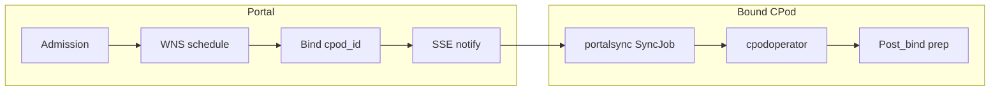
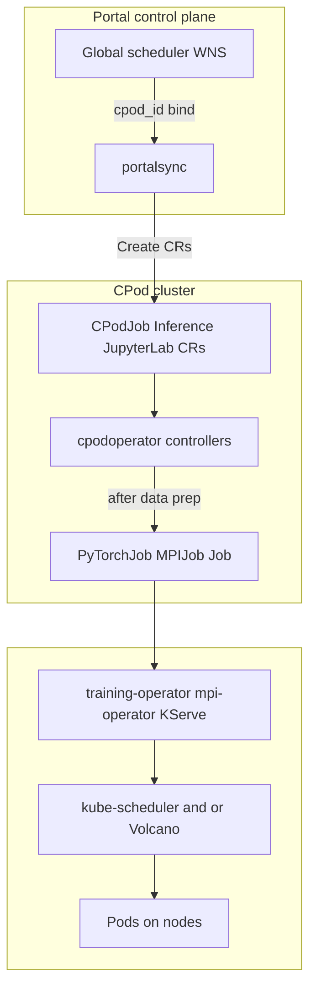

# Global scheduler control plane (target architecture)

This document describes the **portal-side control plane** for federated CPod scheduling: what the global scheduler owns versus what stays on each CPod after bind. It complements [GLOBAL_SCHEDULER_SCORING.md](./GLOBAL_SCHEDULER_SCORING.md) (WNS algorithm and data) and [SYSTEM_ARCHITECTURE.md](./SYSTEM_ARCHITECTURE.md) (portalsync / heartbeat).

**Scope:** design and terminology only—no implementation checklist here.

---

## Phases (portal vs CPod)

| Phase | Where | Responsibility |
|-------|--------|----------------|
| Admission | Portal scheduler APIs | Credits, quota, balance (existing create paths) |
| Schedule | `internal/scheduler/schedule` | WNS: filter → score → normalize → weighted sum; pick **CPod** (target: cluster-level candidates, not global node bind). Multi-replica gang: **`|N_w| ≥ R`** (one replica per distinct node); optional CPod scores **`eligible_pool_headroom`** and **`gang_bottleneck_headroom`** — see [GLOBAL_SCHEDULER_SCORING.md §5.4](./GLOBAL_SCHEDULER_SCORING.md) |
| Bind | Portal MySQL | Set **`cpod_id`** only; no Ingress, no OSS, no K8s Pod placement |
| Notify | Portal → CPod | Target: **SSE assignment watch** to portalsync; relist on reconnect; no steady-state poll for wake |
| Delivery | CPod **portalsync** | Mirror portal jobs as **CPod CRs** (`CPodJob`, `Inference`, `JupyterLab`, …) on the bound cluster |
| Post-bind prep | CPod **cpodoperator** (+ portalsync tenant bootstrap) | Artifacts, child workloads, HTTP routes—**unchanged by bind/watch redesign** (see below) |

**Retire (target):** binding-on-poll as the primary placement trigger—i.e. CPod `GET /cpod/job` driving WNS claim for jobs that are not yet bound. Delivery may still use HTTP for status sync until fully replaced where appropriate.

**Non-goals (this doc):** multi-replica HA for scheduler/portalsync/operator, cross-cluster gang scheduling, Volcano/kube-scheduler policy inside CPod.

---

## Component map

| Component | Binary / path | Role |
|-----------|---------------|------|
| Global scheduler | `cmd/scheduler` | Admission, WNS, bind, assignment watch API (target) |
| portalsync | `cpodoperator/cmd/portalsynch` | **`SyncJob`**: poll/watch portal → create **CPod API CRs**; tenant TensorBoard stack |
| cpodoperator | `cpodoperator/cmd/operator` | Reconcile CRs: data prep, Kubeflow/KServe children, Ingress |
| CPodObserver | `cpodoperator/internal/synchronizer/cpodobserver.go` | Heartbeat: nodes, **cache inventory**, job status |

**SyncJob** is the Go reconciler inside portalsync—not a Kubernetes `Job` resource.

**CPodJob controller** means **`CPodJobReconciler`** in `cpodoperator/internal/controller/cpodjob_controller.go`: reconciles the **`CPodJob`** CR (training), including `PrepareData`, `CreateBaseJob` (PyTorchJob / MPIJob / Job), and status upload—not the global scheduler.

---

## Delivery vs reconcile (who creates what)

| Action | portalsync (SyncJob) | cpodoperator |
|--------|----------------------|--------------|
| Create `CPodJob` / `Inference` / `JupyterLab` / `YAMLResource` from portal | Yes | No |
| OSS download Jobs, `ModelStorage` / `DataSetStorage`, JuiceFS PVCs | No (helpers exist but unused in SyncJob) | Yes—workload `prepareModel` / `prepareDataset` |
| PyTorchJob, MPIJob, KServe `InferenceService`, Jupyter StatefulSet | No | Yes |
| Ingress / Service (Jupyter, Inference, YAML host) | No | Yes |
| TensorBoard Service + Ingress + StatefulSet (per user namespace) | Yes (tenant bootstrap) | No |
| Public catalog copy into user namespace | No | Yes—`CopyPublicModelStorage` / `CopyPublicDatasetStorage` after public download **`Phase == done`** |

Node-level placement inside the CPod remains **training-operator / mpi-operator / KServe + kube-scheduler or Volcano** (cluster install)—not the global scheduler.

---

## Post-bind: CPod-local prep (unchanged)

After **`cpod_id`** is set and portalsync has created the top-level CRs, **cpodoperator** (and a small amount of **portalsync** bootstrap) performs local materialization. **Bind/watch/SSE changes do not replace this layer**—they only change how soon delivery starts.

### Artifact prep (OSS → JuiceFS PVC)

- **Orchestrator:** `CPodJob`, `Inference`, and `JupyterLab` reconcilers run **`PrepareData`** / **`prepareModel`** / **`prepareDataset`**.
- **Flow:** ensure **`ModelStorage`** / **`DataSetStorage`** CR + PVC (JuiceFS CSI where configured) → if `Status.Phase != "done"`, create **`batchv1.Job`** downloader (`CreateDownloadJob` in `cpodjob_controller.go`) → downloader CLI patches storage CR status → parent reconciler requeues until **`done`** → then create training/inference/jupyter child objects.
- **Public assets:** download once in **`public`** namespace; **`CopyPublic*`** clones PV/PVC + copy CR into user namespace (no second OSS pull).
- **`ModelStorage` reconciler:** optional **TensorRT convert** after `Phase == done` only—not OSS download. There is no `DataSetStorage` controller.

OSS path conventions: `cpodoperator/pkg/util/oss.go` (`models/public/…`, `models/{user}/…`, `datasets/…`, `adapters/…`).

### Networking (external HTTP routes)

**External** = user/browser hits the **CPod ingress host** (nginx path or host rules), not the global scheduler.

| Route pattern (typical) | Created by |
|------------------------|------------|
| `/tensorboard/{userNamespace}/…` | portalsync SyncJob (tenant bootstrap) |
| `/jupyterlab/{name}/…` | JupyterLab controller |
| `/inference/{name}/…` (or embedding API path) | Inference controller (KServe/Ray + Ingress) |
| `{app}.{domain}` | YAMLResource controller (Ingress host patch) |

CPodObserver reports **relative paths** on heartbeat; the portal UI prefixes the CPod gateway host.

Training **CPodJob** does not create a dedicated per-job Ingress; logs may mount shared TensorBoard PVC at `/logs` when present.

### Cache inventory (feeds WNS, not download)

- **Existing today:** `CPodObserver.getExistingArtifacts` lists cluster **`ModelStorage` / `DataSetStorage`** (skips copy-labeled clones) → **`HeartBeatPayload.ResourceInfo.Caches`** → **`POST /api/cpod/status`** → upsert **`sys_cpod_cache`** (`cpod_status_logic.go`).
- **Scheduler use:** `BuildClusterSnapshots` attaches `CacheIDs` per CPod → WNS dimension **`cache_locality`** (`scoreCacheLocality` / `cacheHitRatio`) scores whether required model/dataset IDs are **already on cluster**—it does **not** trigger downloads.
- **Lag:** inventory reflects last heartbeat, not live bytes on disk.

### In-cluster compute (after data ready)

- **CPodJob controller:** `CreateBaseJob` → `PyTorchJob`, `MPIJob`, or `batchv1.Job`.
- **Inference controller:** KServe (and optional Ray) + Ingress.
- **Pod placement:** Kubeflow operators + in-cluster scheduler(s)—out of scope for global WNS.

---

## Global scheduler explicitly does not

- Create or patch Kubernetes objects on CPod clusters
- Run OSS downloader Jobs or configure JuiceFS
- Create Ingress, Services, or public URLs
- Choose Kubernetes **nodes** in the target design (CPod-only bind)

---

## Related documents

- [GLOBAL_SCHEDULER_SCORING.md](./GLOBAL_SCHEDULER_SCORING.md)—WNS factors, `sys_cpod_node` / `sys_cpod_cache`, current vs evolving bind semantics
- [SYSTEM_ARCHITECTURE.md](./SYSTEM_ARCHITECTURE.md)—SyncJob, CPodObserver, heartbeat path
- [design_2026_10/CPOD_QUALITY_PROFILE.md](./design_2026_10/CPOD_QUALITY_PROFILE.md)—optional fifth WNS dimension (historical CPod quality)
