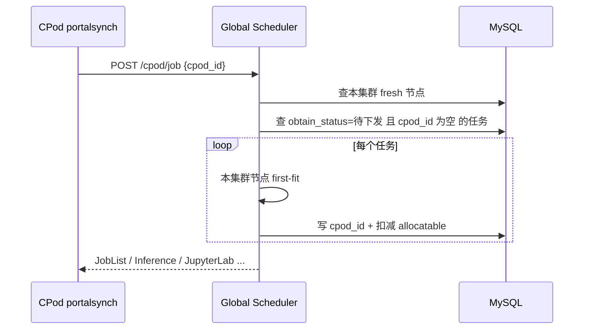
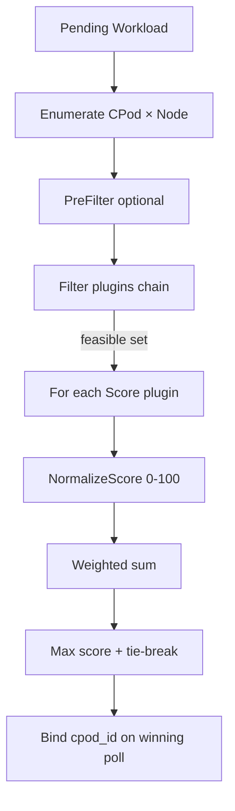
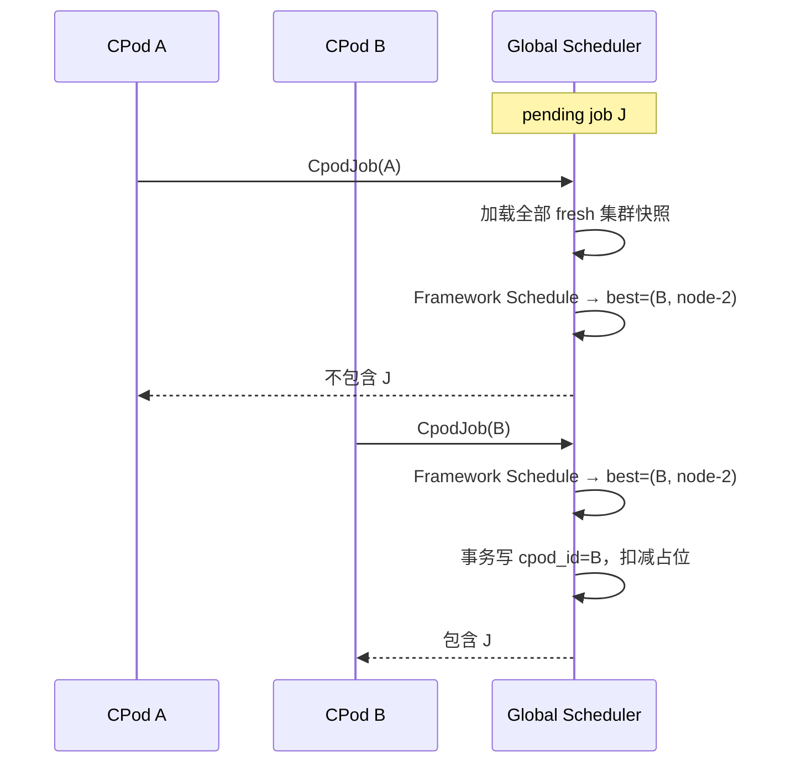

# 3k Global Scheduler：多集群调度框架设计（对齐 kube-scheduler）

本文档描述算想云 Portal Scheduler（`internal/scheduler`）在多 CPod（多 Kubernetes 集群）场景下的**全局调度**方案：实现与 **kube-scheduler Scheduling Framework** 同构的扩展点（Filter → Score → NormalizeScore → 加权求和），在可行 `(cluster, node)` 候选上选优，替代「先拉取先适配（first-fit on poll order）」。

## 一、背景与现状

### 1.1 架构位置

| 组件 | 路径 | 职责 |
|------|------|------|
| Global Scheduler | `cmd/scheduler` + `internal/scheduler/logic/cpod_job_logic.go` | 任务队列、CPod 心跳入库、向 CPod 下发已分配任务 |
| CPod Agent | `cpodoperator/cmd/portalsynch` | 周期拉取任务、上报 `HeartBeat` / `CpodStatus` |
| 资源视图 | `sys_cpod_node`、`sys_cpod_cache` | 节点 allocatable、集群侧模型/数据集缓存 |

当前分配路径（简化）：



### 1.2 现状问题

1. **非全局最优**：`cpod_id` 为空的任务会被**第一个**来 poll 且本地能放下的 CPod 拿走，与集群负载、数据局部性无关。
2. **顺序敏感**：DB 返回节点/任务顺序影响结果，不可复现。
3. **AppJob 无资源校验**：YAML 应用任务对任意 poll 的 CPod 直接绑定。
4. **双账本风险**：Portal 在 `cpod_job` 中扣减 `gpu_allocatable`，心跳在 `cpod_status` 全量覆盖 K8s 真实值；打分应主要依据**心跳快照**，Portal 扣减仅作并发占位（短期）。

---

## 二、设计目标

| 目标 | 说明 |
|------|------|
| 全局选优 | 同一 pending 任务在所有**可行** CPod 间比较，而非 poll 顺序 |
| 可配置 | 各打分因子权重、开关可配置（`scheduler-api*.yaml`） |
| 可解释 | 每次 placement 输出因子 raw / normalized / weighted 明细，便于审计与排障 |
| 渐进落地 | 先训练/微调 Job，再推理/JupyterLab/AppJob；API 与 CPod pull 模型不变 |
| 兼容亲和 | 用户指定 `cpod_id`、GPU 型号等硬约束保持不变 |

非目标（本期）：跨集群 gang scheduling、抢占、与 CPod 内 default scheduler **共用同一插件二进制**（逻辑对齐，非进程合并）。

---

## 三、与 kube-scheduler 的对应关系

3k 的「节点」= `(CPod, K8s Node)`；「Pod」= Portal 上一条待下发的 Workload（训练/推理等）。

| kube-scheduler 扩展点 | 3k Global Scheduler | 说明 |
|----------------------|---------------------|------|
| **Scheduling Queue** | DB `obtain_status=待下发` + 任务创建时间 | 等价待调度队列；后续可加 QueueSortPlugin |
| **PreFilter** | （预留）`CycleState` | 集群级预过滤、资源预占 |
| **Filter** | `FilterPlugin` | 硬约束，失败则 `Unschedulable` |
| **PostFilter** | （预留） | 无可行节点时的回溯 / 抢占 |
| **PreScore** | （预留） | 缩小候选集 |
| **Score** | `ScorePlugin.Score()` | 每个插件返回 `int64` 原始分 |
| **NormalizeScore** | `normalizePluginScores()` | 与 upstream 相同：缩放到 `[0, MaxNodeScore]`，`MaxNodeScore=100` |
| **Bind** | `CpodJob` 写 `cpod_id` + CPod pull | 等价绑定到集群 |
| **Reserve** | Portal 扣减 `*_allocatable` | 短期占位；真实容量以心跳为准 |

### 3.1 内置插件与 upstream 插件类比

| 3k 插件名 | 类型 | 类比 kube-scheduler 插件 |
|-----------|------|---------------------------|
| `CpodSelector` | Filter | `NodeAffinity` / `InterPodAffinity`（required）— 用户指定 CPod |
| `NodeResourcesFit` | Filter | `NodeResourcesFit` — GPU/CPU/内存 |
| `NodeResourcesBalancedAllocation` | Score | 同名 — 倾向放置后仍有余量的节点 |
| `NodeResourcesLeastAllocated` | Score | 同名 — 倾向集群内 GPU 空闲更多 |
| `CacheLocality` | Score | 类似 `ImageLocality` — 模型/数据集已在 CPod 缓存 |
| `NodeCost` | Score | 平台扩展 — 单价（`sys_price`） |

插件实现：`internal/scheduler/schedule/plugins.go`；框架循环：`framework.go`。

### 3.2 打分合成（与 upstream 一致）

对每个 **Score 插件** \(p\)，在当次所有可行候选上收集原始分 \(s_p(n)\)，再：

\[
\widehat{s}_p(n) = \begin{cases}
\text{MaxNodeScore} & \max s_p = \min s_p \land s_p(n) > 0 \\
0 & \max s_p = \min s_p \land s_p(n) = 0 \\
\text{MaxNodeScore} \cdot \dfrac{s_p(n)-\min s_p}{\max s_p - \min s_p} & \text{otherwise}
\end{cases}
\]

节点总分（整数，便于日志与指标）：

\[
S(n) = \sum_p w_p \cdot \widehat{s}_p(n)
\]

其中 \(w_p\) 来自配置 `Scheduling.Weights`（YAML 小数 ×100 转为插件 weight，与 kube `pluginConfig.weight` 同义）。

---

## 四、核心模型

### 4.1 调度单元

- **Workload**：一次待 placement 的工作负载（训练 Job、推理、JupyterLab 等），包含资源需求与可选亲和/缓存需求。
- **ClusterSnapshot**：单个 CPod 在某时刻的聚合视图（节点列表、缓存集合、健康度、可选单价）。
- **Candidate**：可行的 `(CpodID, NodeID)` 对。

### 4.2 调度周期（Framework Cycle）



**Filter**：任一插件返回非 Success → 候选剔除（与 `UnschedulableAndUnresolvable` 语义类似，暂不区分可恢复/不可恢复）。

**Score**：仅对可行集打分；同分按 `CpodID`、`NodeName` 字典序（确定性，等价于 kube 的 tie-break 扩展）。

---

## 五、Score 插件语义（配置权重）

| 插件 | Score 原始值 | 默认 YAML 权重 |
|------|--------------|----------------|
| `NodeResourcesBalancedAllocation` | 放置后 GPU/CPU 剩余比例 × 100 | 0.35 |
| `NodeResourcesLeastAllocated` | 集群 GPU allocatable/total × 100 | 0.25 |
| `CacheLocality` | 缓存命中率 × 100 | 0.25 |
| `NodeCost` | 单价倒数（仅在有定价的候选间 Normalize） | 0.15 |

新增插件：实现 `FilterPlugin` / `ScorePlugin` 并注册到 `DefaultFramework` 或独立 Scheduling Profile（与 kube 多 Profile 相同思路）。

### 5.1 因子扩展（后续）

- **网络/地域**：`region`、`latency_ms` 标签。
- **队列等待**：pending 越久权重微调（公平性）。
- **能耗 / 碳强度**：外部指标注入 ClusterSnapshot。
- **多副本 gang**：改为「集群级可行 + 集群内 bin-pack」两阶段。

---

## 六、与 Pull 模型的结合

保持 CPod **主动拉取**不变，改变 Global Scheduler 在 `CpodJob` 内的决策：



要点：

1. **全局视图**：`CpodJob` 查询**所有** `updated_at` 在窗口内的 `sys_cpod_node`（如 30 分钟），而非仅 `req.CpodId`。
2. **赢家才绑定**：仅当 `best.CpodID == req.CpodId` 时写入 `cpod_id` 并返回任务。
3. **并发**：对 `job_id` / `infer_id` 等 `SELECT ... FOR UPDATE` 或 `UPDATE ... WHERE cpod_id='' AND id=?` 乐观锁，避免双分配。
4. **Poll 未中**：非赢家 CPod 无额外副作用，下次心跳仍可见全局 pending。

可选增强（Phase 3）：任务创建时**异步**运行 WNS 并写入 `cpod_id`，`CpodJob` 只做下发，进一步降低 poll 竞态窗口。

---

## 七、数据依赖

| 表 / API | 用途 |
|----------|------|
| `sys_cpod_node` | 节点 allocatable、GPU 型号、心跳时间 |
| `sys_cpod_cache` | 模型/数据集是否已在集群缓存 |
| `sys_price`（经 `GpuTypeAndPrice`） | 成本因子 |
| `BannedCpod` | 硬过滤 |
| 任务表 `cpod_id`、`gpu_type`、`gpu_number` | 需求与亲和 |

Workload 缓存需求映射示例：

| 任务类型 | `CacheIDs` 来源 |
|----------|-----------------|
| Finetune / CPodJob | `pretrained_model_name`、`dataset_name` 转 CRD/OSS id |
| Inference | metadata 中 model / adapter |
| JupyterLab | `Resource` JSON 内模型/数据集 |

---

## 八、配置

在 `scheduler-api*.yaml` 增加（示例）：

```yaml
Scheduling:
  Enabled: true
  NodeFreshWindow: 30m
  Weights:
    ResourceHeadroom: 0.35
    LoadBalance: 0.25
    CacheLocality: 0.25
    Cost: 0.15
```

`Enabled: false` 时回退 legacy first-fit（仅本 CPod 节点列表）。

---

## 九、可观测性

- 日志：`framework score=... plugins=[{name,raw,norm,weight,weighted}]`（字段同 kube 调度日志中的 plugin scores）
- 指标（建议）：`scheduler_placement_total{result=assigned|skipped|infeasible}`、`scheduler_score_histogram`
- API（可选）：管理员查询某 job 最近一次打分明细

---

## 十、落地计划

| 阶段 | 范围 | 说明 |
|------|------|------|
| P0 | 文档 + `schedule` Framework + 单元测试 | kube 同构 Filter/Score/Normalize |
| P1 | `CpodJob` 训练/微调 Job + 配置开关 | 全局 Framework，兼容指定 CPod |
| P2 | Inference、JupyterLab、AppJob 资源校验 + WNS | 统一 `WorkloadKind` |
| P3 | DB 行锁 + 创建时异步 placement | 消除 poll 竞态 |
| P4 | 因子扩展、A/B 权重 | 运维调参 |

代码入口：

- 调度框架：`internal/scheduler/schedule/framework.go`
- 内置插件：`internal/scheduler/schedule/plugins.go`
- 便捷入口：`internal/scheduler/schedule/engine.go`（`Score` / `ScoreForCluster`）
- 集群快照构建：`internal/scheduler/schedule/snapshot.go`
- 与 `CpodJob` 集成：`internal/scheduler/logic/cpod_job_logic.go`（P1）

---

## 十一、相关文档

- [Kubernetes Scheduling Framework](https://kubernetes.io/docs/concepts/scheduling-eviction/scheduling-framework/)（扩展点与 NormalizeScore 语义参考）

- [SYSTEM_ARCHITECTURE.md](./SYSTEM_ARCHITECTURE.md)
- CPod 资源模型：`cpodoperator/pkg/resource/resource.go`
