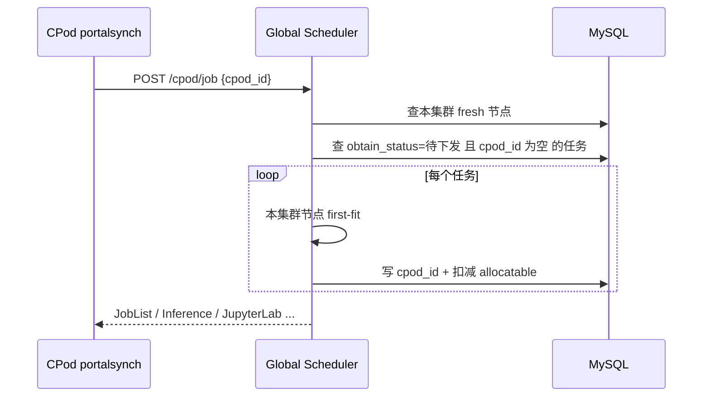
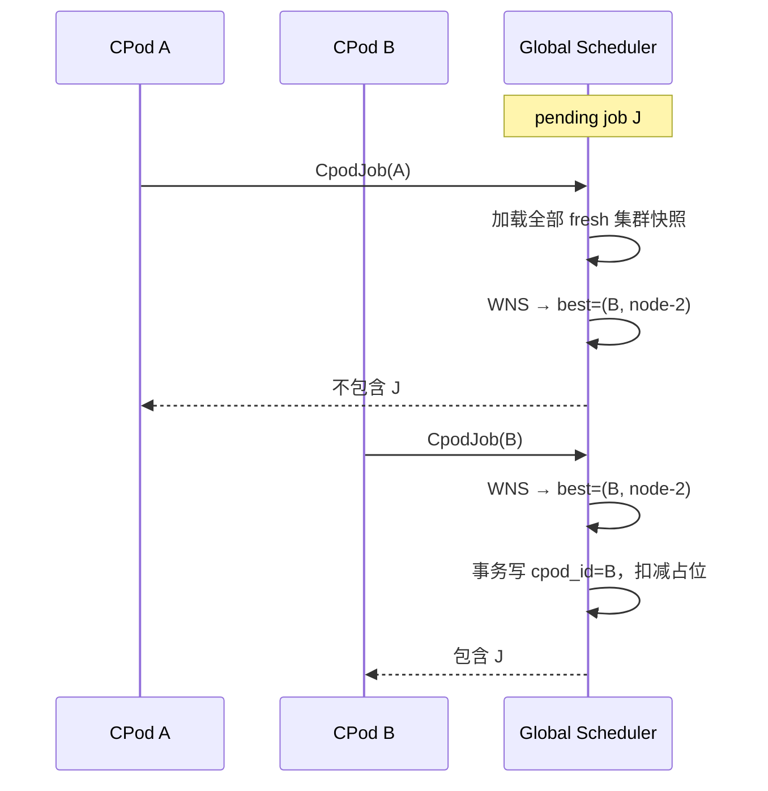

# 3k Global Scheduler：多集群加权归一化打分调度设计

本文档描述算想云 Portal Scheduler（`internal/scheduler`）在多 CPod（多 Kubernetes 集群）场景下的**全局调度**方案：在硬约束过滤之后，对可行 `(cluster, node)` 候选使用**加权归一化打分（Weighted Normalized Scoring, WNS）**选优，替代当前的「先拉取先适配（first-fit on poll order）」策略。

## 一、背景与现状

### 1.1 架构位置

| 组件 | 路径 | 职责 |
|------|------|------|
| Global Scheduler | `cmd/scheduler` + `internal/scheduler/logic/cpod_job_logic.go` | 任务队列、CPod 心跳入库、向 CPod 下发已分配任务 |
| CPod Agent | `cpodoperator/cmd/portalsynch` | 周期拉取任务、上报 `HeartBeat` / `CpodStatus` |
| 资源视图 | `sys_cpod_node`、`sys_cpod_cache` | 节点 allocatable、集群侧模型/数据集缓存 |

当前分配路径（简化）：



### 1.2 现状问题

1. **非全局最优**：`cpod_id` 为空的任务会被**第一个**来 poll 且本地能放下的 CPod 拿走，与集群负载、数据局部性无关。
2. **顺序敏感**：DB 返回节点/任务顺序影响结果，不可复现。
3. **AppJob 无资源校验**：YAML 应用任务对任意 poll 的 CPod 直接绑定。
4. **双账本风险**：Portal 在 `cpod_job` 中扣减 `gpu_allocatable`，心跳在 `cpod_status` 全量覆盖 K8s 真实值；打分应主要依据**心跳快照**，Portal 扣减仅作并发占位（短期）。

---

## 二、设计目标

| 目标 | 说明 |
|------|------|
| 全局选优 | 同一 pending 任务在所有**可行** CPod 间比较，而非 poll 顺序 |
| 可配置 | 各打分因子权重、开关可配置（`scheduler-api*.yaml`） |
| 可解释 | 每次 placement 输出因子 raw / normalized / weighted 明细，便于审计与排障 |
| 渐进落地 | 先训练/微调 Job，再推理/JupyterLab/AppJob；API 与 CPod pull 模型不变 |
| 兼容亲和 | 用户指定 `cpod_id`、GPU 型号等硬约束保持不变 |

非目标（本期）：跨集群 gang scheduling、抢占、实时 GPU 拓扑（NVLink/IB 感知）、与 K8s default scheduler 统一插件链。

---

## 三、核心模型

### 3.1 调度单元

- **Workload**：一次待 placement 的工作负载（训练 Job、推理、JupyterLab 等），包含资源需求与可选亲和/缓存需求。
- **ClusterSnapshot**：单个 CPod 在某时刻的聚合视图（节点列表、缓存集合、健康度、可选单价）。
- **Candidate**：可行的 `(CpodID, NodeID)` 对。

### 3.2 两阶段流水线


**硬约束（Filter）**：任一不满足则该 Candidate 不参与打分。

**软目标（Score）**：在剩余 Candidate 上计算加权归一化总分，取最大者；同分按 `CpodID`、`NodeName` 字典序打破平局（确定性）。

---

## 四、打分因子

所有软因子在**当次调度**的所有可行 Candidate 上做 **min-max 归一化**到 \([0,1]\)。

| 因子 | 方向 | Raw 定义（示例） | 默认权重 |
|------|------|------------------|----------|
| `resource_headroom` | 越大越好 | 放置后节点 GPU 剩余率：\((A - req)/A\) | 0.35 |
| `load_balance` | 越大越好 | 集群 GPU 空闲率：\(1 - \sum used/\sum total\) | 0.25 |
| `cache_locality` | 越大越好 | \(\|required \cap cached\| / \|required\|\)，无需求时为 1 | 0.25 |
| `cost` | 越便宜越好 | 使用 `GpuTypeAndPrice` 单价，归一化时用 \((max-min)\) 反向 | 0.15 |

归一化（越大越好）：

\[
norm(x) = \begin{cases}
0.5 & max = min \\
\frac{x - min}{max - min} & otherwise
\end{cases}
\]

越大越好因子直接代入；**越小越好**（如 cost）先令 \(x' = max - x\) 再归一化。

总分：

\[
S = \frac{\sum_i w_i \cdot norm_i}{\sum_i w_i}
\]

实现见 `internal/scheduler/schedule/`。

### 4.1 因子扩展（后续）

- **网络/地域**：`region`、`latency_ms` 标签。
- **队列等待**：pending 越久权重微调（公平性）。
- **能耗 / 碳强度**：外部指标注入 ClusterSnapshot。
- **多副本 gang**：改为「集群级可行 + 集群内 bin-pack」两阶段。

---

## 五、与 Pull 模型的结合

保持 CPod **主动拉取**不变，改变 Global Scheduler 在 `CpodJob` 内的决策：



要点：

1. **全局视图**：`CpodJob` 查询**所有** `updated_at` 在窗口内的 `sys_cpod_node`（如 30 分钟），而非仅 `req.CpodId`。
2. **赢家才绑定**：仅当 `best.CpodID == req.CpodId` 时写入 `cpod_id` 并返回任务。
3. **并发**：对 `job_id` / `infer_id` 等 `SELECT ... FOR UPDATE` 或 `UPDATE ... WHERE cpod_id='' AND id=?` 乐观锁，避免双分配。
4. **Poll 未中**：非赢家 CPod 无额外副作用，下次心跳仍可见全局 pending。

可选增强（Phase 3）：任务创建时**异步**运行 WNS 并写入 `cpod_id`，`CpodJob` 只做下发，进一步降低 poll 竞态窗口。

---

## 六、数据依赖

| 表 / API | 用途 |
|----------|------|
| `sys_cpod_node` | 节点 allocatable、GPU 型号、心跳时间 |
| `sys_cpod_cache` | 模型/数据集是否已在集群缓存 |
| `sys_price`（经 `GpuTypeAndPrice`） | 成本因子 |
| `BannedCpod` | 硬过滤 |
| 任务表 `cpod_id`、`gpu_type`、`gpu_number` | 需求与亲和 |

Workload 缓存需求映射示例：

| 任务类型 | `CacheIDs` 来源 |
|----------|-----------------|
| Finetune / CPodJob | `pretrained_model_name`、`dataset_name` 转 CRD/OSS id |
| Inference | metadata 中 model / adapter |
| JupyterLab | `Resource` JSON 内模型/数据集 |

---

## 七、配置

在 `scheduler-api*.yaml` 增加（示例）：

```yaml
Scheduling:
  Enabled: true
  NodeFreshWindow: 30m
  Weights:
    ResourceHeadroom: 0.35
    LoadBalance: 0.25
    CacheLocality: 0.25
    Cost: 0.15
```

`Enabled: false` 时回退 legacy first-fit（仅本 CPod 节点列表）。

---

## 八、可观测性

- 日志：`placement workload=... winner=cpod/node score=... factors=[{name,raw,norm,weight}]`
- 指标（建议）：`scheduler_placement_total{result=assigned|skipped|infeasible}`、`scheduler_score_histogram`
- API（可选）：管理员查询某 job 最近一次打分明细

---

## 九、落地计划

| 阶段 | 范围 | 说明 |
|------|------|------|
| P0 | 文档 + `schedule` 包 + 单元测试 | 纯函数、无 DB |
| P1 | `CpodJob` 训练/微调 Job + 配置开关 | 全局 WNS，兼容指定 CPod |
| P2 | Inference、JupyterLab、AppJob 资源校验 + WNS | 统一 `WorkloadKind` |
| P3 | DB 行锁 + 创建时异步 placement | 消除 poll 竞态 |
| P4 | 因子扩展、A/B 权重 | 运维调参 |

代码入口：

- 打分引擎：`internal/scheduler/schedule/engine.go`
- 集群快照构建：`internal/scheduler/schedule/snapshot.go`
- 与 `CpodJob` 集成：`internal/scheduler/logic/cpod_job_logic.go`（P1）

---

## 十、相关文档

- [SYSTEM_ARCHITECTURE.md](./SYSTEM_ARCHITECTURE.md)
- CPod 资源模型：`cpodoperator/pkg/resource/resource.go`
