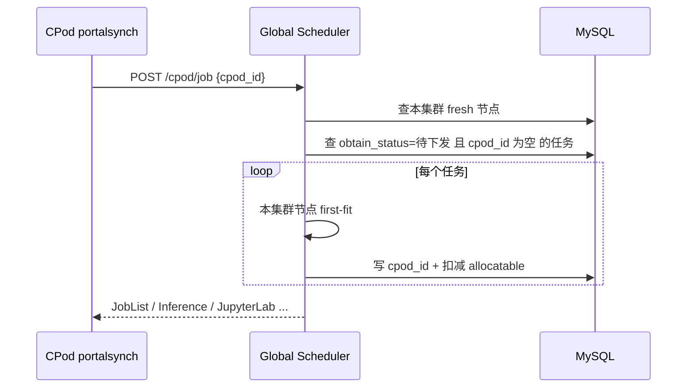
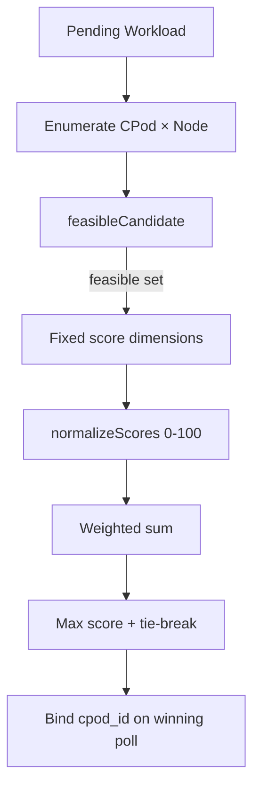

# 3k Global Scheduler：多集群加权调度设计（内聚实现）

本文档描述算想云 Portal Scheduler（`internal/scheduler`）在多 CPod（多 Kubernetes 集群）场景下的**全局调度**方案：**内聚、不可扩展**的固定策略（硬约束过滤 → 多维度打分 → 归一化 → 加权求和），在可行 `(cluster, node)` 候选上选优，替代「先拉取先适配（first-fit on poll order）」。算法阶段与 kube-scheduler 类似，但**不提供插件接口**——逻辑全部在 `internal/scheduler/schedule/scheduler.go` 中维护。

## 一、背景与现状

### 1.1 架构位置

| 组件 | 路径 | 职责 |
|------|------|------|
| Global Scheduler | `cmd/scheduler` + `internal/scheduler/logic/cpod_job_logic.go` | 任务队列、CPod 心跳入库、向 CPod 下发已分配任务 |
| CPod Agent | `cpodoperator/cmd/portalsynch` | 周期拉取任务、上报 `HeartBeat` / `CpodStatus` |
| 资源视图 | `sys_cpod_node`、`sys_cpod_cache` | 节点 allocatable、集群侧模型/数据集缓存 |

当前分配路径（简化）：



### 1.2 现状问题

1. **非全局最优**：`cpod_id` 为空的任务会被**第一个**来 poll 且本地能放下的 CPod 拿走，与集群负载、数据局部性无关。
2. **顺序敏感**：DB 返回节点/任务顺序影响结果，不可复现。
3. **AppJob 无资源校验**：YAML 应用任务对任意 poll 的 CPod 直接绑定（`Scheduling.Enabled` 时仍用占位 `Workload{CPUCores:1}`，见 [YXZ-14](https://linear.app/yxzhao/issue/YXZ-14/appjob-resource-model-for-global-scheduler-placement)）。
4. **双账本风险**：Portal 在 `cpod_job` 中扣减 `gpu_allocatable`，心跳在 `cpod_status` 全量覆盖 K8s 真实值；打分应主要依据**心跳快照**，Portal 扣减仅作并发占位（短期）。

---

## 二、设计目标

| 目标 | 说明 |
|------|------|
| 全局选优 | 同一 pending 任务在所有**可行** CPod 间比较，而非 poll 顺序 |
| 可配置 | 各打分因子权重、开关可配置（`scheduler-api*.yaml`） |
| 可解释 | 每次 placement 输出因子 raw / normalized / weighted 明细，便于审计与排障 |
| 渐进落地 | 先训练/微调 Job，再推理/JupyterLab/AppJob；API 与 CPod pull 模型不变 |
| 兼容亲和 | 用户指定 `cpod_id`、GPU 型号等硬约束保持不变 |

非目标（本期）：跨集群 gang scheduling、抢占、可插拔调度扩展 API。

---

## 三、调度流水线（内聚实现）

3k 的「节点」= `(CPod, K8s Node)`；「Pod」= Portal 上一条待下发的 Workload（训练/推理等）。

| 阶段 | 实现 | 说明 |
|------|------|------|
| 待调度队列 | DB `obtain_status=待下发` | 按现有任务表顺序处理 |
| 硬约束 | `feasibleCandidate()` | CPod 亲和、GPU/CPU/内存 fit |
| 软目标 | 四个固定 `score*` 函数 | 见下表 |
| 归一化 | `normalizeScores()` | 每维度在可行集上缩放到 `[0, 100]` |
| 绑定 | `CpodJob` 写 `cpod_id` | 仅 global 最高分且等于 polling CPod 时绑定 |
| 占位 | Portal 扣减 `*_allocatable` | 短期；真实容量以心跳为准 |

### 3.1 固定策略（非插件）

| 维度名 | 类型 | 语义 |
|--------|------|------|
| （硬约束）CPod 指定 | Filter | `PinCluster` 非空时必须匹配 |
| （硬约束）资源 fit | Filter | GPU 型号/数量、CPU、内存 |
| `resource_headroom` | Score | 放置后节点资源剩余比例 |
| `load_balance` | Score | 集群 GPU 空闲比例 |
| `cache_locality` | Score | 所需模型/数据集缓存命中率 |
| `cost` | Score | 单价越低越好（有定价时参与归一化） |

代码入口：`internal/scheduler/schedule/scheduler.go`（`schedule()` 私有函数）；对外仅 `Score` / `ScoreForCluster`。

### 3.2 打分合成

对每个维度 \(d\)，在当次所有可行候选上收集原始分 \(s_d(n)\)，再：

\[
\widehat{s}_p(n) = \begin{cases}
\text{MaxNodeScore} & \max s_p = \min s_p \land s_p(n) > 0 \\
0 & \max s_p = \min s_p \land s_p(n) = 0 \\
\text{MaxNodeScore} \cdot \dfrac{s_p(n)-\min s_p}{\max s_p - \min s_p} & \text{otherwise}
\end{cases}
\]

节点总分（整数，便于日志与指标）：

\[
S(n) = \sum_p w_p \cdot \widehat{s}_p(n)
\]

其中 \(w_d\) 来自配置 `Scheduling.Weights`（YAML 小数 ×100 转为整数权重）。

---

## 四、核心模型

### 4.1 调度单元

- **Workload**：一次待 placement 的工作负载（训练 Job、推理、JupyterLab 等），包含资源需求与可选亲和/缓存需求。
- **ClusterSnapshot**：单个 CPod 在某时刻的聚合视图（节点列表、缓存集合、健康度、可选单价）。
- **Candidate**：可行的 `(CpodID, NodeID)` 对。

### 4.2 调度周期



同分按 `CpodID`、`NodeName` 字典序打破平局（确定性）。

---

## 五、打分维度（配置权重）

| 维度 | 原始分 | 默认 YAML 权重 |
|------|--------|----------------|
| `resource_headroom` | 放置后 GPU/CPU 剩余比例 × 100 | 0.35 |
| `load_balance` | 集群 GPU allocatable/total × 100 | 0.25 |
| `cache_locality` | 缓存命中率 × 100 | 0.25 |
| `cost` | 单价倒数 | 0.15 |

新增维度时直接修改 `scheduler.go` 中的 `scoreDimensions()` 与对应函数（无注册表/接口）。

配置说明：`WeightsFromConfig` 在四个权重**全为 0** 时使用默认值；任一非 0 则按 YAML 原样使用，**单个 0 表示关闭该维度**。

### 5.1 集成注意（`CpodJob`）

- `Scheduling.Enabled=true` 时：一次加载全部 fresh 节点，构建 `clusterSnapshots`；本 CPod 的 `nodes` 与 `nodeByID` **共享同一指针**，训练任务分配后推理/Jupyter 能看到扣减后的容量。
- `CommitPlacement` 同时更新 snapshot（后续 Score）与 live node（DB 落库）。
- 同一请求内多个 pending 任务按 DB 顺序依次 Score；跨 CPod 并发 poll 通过 **乐观 claim**（`UPDATE … WHERE cpod_id IS NULL/''`）避免双分配，失败则 `RevertPlacement`。
- 训练 / 推理 / JupyterLab / AppJob 在 `Scheduling.Enabled` 时均走全局 Score；legacy 路径也使用 claim。

### 5.2 已知算法局限（探索性测试 `explore_stress_test.go`）

| 现象 | 原因 |
|------|------|
| Pull 饿死 | 仅 global 最高分 CPod 在 poll 时绑定 |
| load_balance 偏置 | 空闲集群得分更高，难以回填热集群 |
| 归一化坍缩 | 某维度 raw 全相同 → 该维度不区分候选 |
| 序贯贪心 | 单 job Score 最优 ≠ 多 job 装箱最优 |
| 同分 | `cpod_id` / `node_name` 字典序 |

### 5.3 后续可增维度（改代码，非插件）

- **网络/地域**：`region`、`latency_ms` 标签。
- **队列等待**：pending 越久权重微调（公平性）。
- **能耗 / 碳强度**：外部指标注入 ClusterSnapshot。
- **多副本 gang**：改为「集群级可行 + 集群内 bin-pack」两阶段。

---

## 六、与 Pull 模型的结合

保持 CPod **主动拉取**不变，改变 Global Scheduler 在 `CpodJob` 内的决策：


要点：

1. **全局视图**：`CpodJob` 查询**所有** `updated_at` 在窗口内的 `sys_cpod_node`（如 30 分钟），而非仅 `req.CpodId`。
2. **赢家才绑定**：仅当 `best.CpodID == req.CpodId` 时写入 `cpod_id` 并返回任务。
3. **并发**：对 `job_id` / `infer_id` 等 `SELECT ... FOR UPDATE` 或 `UPDATE ... WHERE cpod_id='' AND id=?` 乐观锁，避免双分配。
4. **Poll 未中**：非赢家 CPod 无额外副作用，下次心跳仍可见全局 pending。

可选增强（Phase 3）：任务创建时**异步**运行 WNS 并写入 `cpod_id`，`CpodJob` 只做下发，进一步降低 poll 竞态窗口。

---

## 七、数据依赖

CPod 侧如何采集并上报节点与缓存：见 [SYSTEM_ARCHITECTURE.md](./SYSTEM_ARCHITECTURE.md) **§2.3 Heartbeat 与 CPod 节点资源**（`CPodObserver` → `POST /api/cpod/status` → upsert `sys_cpod_node`）。

| 表 / API | 用途 |
|----------|------|
| `sys_cpod_node` | 节点 allocatable、GPU 型号、心跳时间 |
| `sys_cpod_cache` | 模型/数据集是否已在集群缓存 |
| `sys_price`（经 `GpuTypeAndPrice`） | 成本因子 |
| `BannedCpod` | 硬过滤 |
| 任务表 `cpod_id`、`gpu_type`、`gpu_number` | 需求与亲和 |

Workload 缓存需求映射示例：

| 任务类型 | `CacheIDs` 来源 |
|----------|-----------------|
| Finetune / CPodJob | `pretrained_model_name`、`dataset_name` 转 CRD/OSS id |
| Inference | metadata 中 model / adapter |
| JupyterLab | `Resource` JSON 内模型/数据集 |
| AppJob | **未实现** — 占位 1 CPU；需从 `SysApp.Crd` / `Meta` 解析（[YXZ-14](https://linear.app/yxzhao/issue/YXZ-14/appjob-resource-model-for-global-scheduler-placement)） |

---

## 八、配置

在 `scheduler-api*.yaml` 增加（示例）：

```yaml
Scheduling:
  Enabled: true
  NodeFreshWindow: 30m
  Weights:
    ResourceHeadroom: 0.35
    LoadBalance: 0.25
    CacheLocality: 0.25
    Cost: 0.15
```

`Enabled: false` 时回退 legacy first-fit（仅本 CPod 节点列表）。

---

## 九、可观测性与测试

- 日志：`schedule score=... breakdown=[{name,raw,norm,weight,weighted}]`
- 指标（建议）：`scheduler_placement_total{result=assigned|skipped|infeasible}`、`scheduler_score_histogram`
- 单元测试：`internal/scheduler/schedule/*_test.go`
- 探索性压测：`explore_stress_test.go`（`go test -run Explore`；`-short` 跳过）— 统计 tie-break 偏置、归一化坍缩、pull 模型饿死、贪心序贯 vs 小规模最优装箱等退化行为，结果仅 `t.Log` 不强制 CI 失败

---

## 十、落地计划

| 阶段 | 范围 | 说明 |
|------|------|------|
| P0 | 文档 + `schedule` 包 + 单元测试 | 内聚 Filter/Score/Normalize |
| P1 | `CpodJob` 训练/微调 Job + 配置开关 | 已完成 |
| P2 | Inference、JupyterLab、AppJob + 缓存 ID | 已完成（`workload.go` / `cpod_schedule.go`） |
| P3 | 乐观 claim + placement 回滚 | 已完成 |
| P4 | 创建时异步 placement、因子 A/B 调参 | 可选增强 |

代码入口：

- 调度核心：`internal/scheduler/schedule/scheduler.go`（`Score` / `ScoreForCluster`）
- 集群快照与 placement：`internal/scheduler/schedule/snapshot.go`
- Workload / 缓存 ID：`internal/scheduler/schedule/workload.go`
- Claim 与集成：`internal/scheduler/logic/cpod_schedule.go`、`cpod_job_logic.go`

---

## 十一、相关文档

- [SYSTEM_ARCHITECTURE.md](./SYSTEM_ARCHITECTURE.md)
- CPod 资源模型：`cpodoperator/pkg/resource/resource.go`
